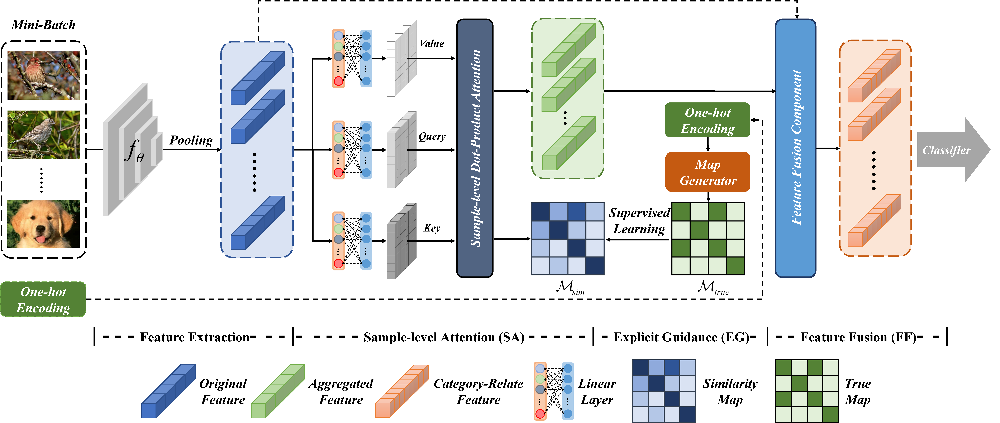

# Exploring Sample Relationship for Few-Shot Classification

## Description
This repository is the official implementation of **Exploring Sample Relationship for Few-Shot Classification**.
         
> Xingye Chen, Wenxiao Wu, Li Ma, Xinge You, Changxin Gao,Nong Sang, Yuanjie Shao      

  

## Application to ProtoNet

Please refer to the instructions in this [README](SRE-ProtoNet/README.md).

## Application to EASY
Please refer to the instructions in this [README](SRE-EASY/README.md).

## Acknowledgment

Our implementation is mainly based on the following codebases. We gratefully thank the authors for their wonderful works.

[CloserLookFewShot](https://github.com/wyharveychen/CloserLookFewShot),
[DeepBDC](https://github.com/Fei-Long121/DeepBDC),
[EASY](https://github.com/ybendou/easy)
